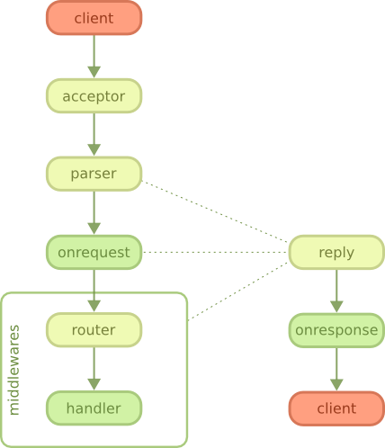

The life of a request
=====================

This chapter explains the different steps a request goes through until 
a response is sent, along with details of the Cowboy implementation.

Request/response
----------------

As you already know, HTTP clients connect to the server and send a 
request for a resource; the server then sends a response containing the 
resource if it could obtain it.

Before the server can send the resource, however, it needs to perform 
many different operations to read the request, find the resource, 
prepare the response being sent and often other related operations the 
user can add like writing logs.

Requests take the following route in Cowboy:



This shows the default middlewares, but they may be configured 
differently in your setup. The dark green indicates the points where 
you can hook your own code, the light green is the Cowboy code that you 
can of course configure as needed.

The `acceptor` is the part of the server that accepts the connection 
and create an Erlang process to handle it. The `parser` then starts 
reading from the socket and handling requests as they come until the 
socket is closed.

A response may be sent at many different points in the life of the 
request. If Cowboy can't parse the request, it gives up with an error 
response. If the router can't find the resource, it sends a not found 
error. Your own code can of course send a response at any time.

When a response is sent, you can optionally modify it or act upon it by 
enabling the `onresponse` hook. By default the response is sent 
directly to the client.

And then?
---------

Behavior depends on what protocol is in use.

HTTP/1.0 can only process one request per connection, so Cowboy will 
close the connection immediately after it sends the response.

HTTP/1.1 allows the client to request that the server keeps the 
connection alive. This mechanism is described in the next section.

SPDY is designed to allow sending multiple requests asynchronously on 
the same connection. Details on what this means for your application is 
described in this chapter.

Keep-alive (HTTP/1.1)
---------------------

With HTTP/1.1, the connection may be left open for subsequent requests 
to come. This mechanism is called `keep-alive`.

When the client sends a request to the server, it includes a header 
indicating whether it would like to leave the socket open. The server 
may or may not accept, indicating its choice by sending the same header 
in the response.

Cowboy will include this header automatically in all responses to 
HTTP/1.1 requests. You can however force the closing of the socket if 
you want. When Cowboy sees you want to send a `connection: close` 
header, it will not override it and will close the connection as soon 
as the reply is sent.

This snippet will force Cowboy to close the connection.

``` erlang
{ok, Req2} = cowboy_req:reply(200, [
    {<<"connection">>, <<"close">>},
], <<"Closing the socket in 3.. 2.. 1..">>, Req).
```

Cowboy will only accept a certain number of new requests on the same 
connection. By default it will run up to 100 requests. This number can 
be changed by setting the `max_keepalive` configuration value when 
starting an HTTP listener.

``` erlang
cowboy:start_http(my_http_listener, 100, [{port, 8080}], [
        {env, [{dispatch, Dispatch}]},
        {max_keepalive, 5}
]).
```

Cowboy implements the keep-alive mechanism by reusing the same process 
for all requests. This allows Cowboy to save memory. This works well 
because most code will not have any side effect impacting subsequent 
requests. But it also means you need to clean up if you do have code 
with side effects. The `terminate/3` function can be used for this 
purpose.

Pipelining (HTTP/1.1)
---------------------

While HTTP is designed as a sequential protocol, with the client 
sending a request and then waiting for the response from the server, 
nothing prevents the client from sending more requests to the server 
without waiting for the response, due to how sockets work. The server 
still handles the requests sequentially and sends the responses in the 
same order.

This mechanism is called pipelining. It allows reducing latency when a 
client needs to request many resources at the same time. This is used 
by browsers when requesting static files for example.

This is handled automatically by the server.

Asynchronous requests (SPDY)
----------------------------

In SPDY, the client can send a request at any time. And the server can 
send a response at any time too.

This means for example that the client does not need to wait for a 
request to be fully sent to send another, it is possible to interleave 
a request with the request body of another request. The same is true 
with responses. Responses may also be sent in a different order.

Because requests and responses are fully asynchronous, Cowboy creates a 
new process for each request, and these processes are managed by 
another process that handles the connection itself.

SPDY servers may also decide to send resources to the client before the 
client requests them. This is especially useful for sending static 
files associated with the HTML page requested, as this reduces the 
latency of the overall response. Cowboy does not support this 
particular mechanism at this point, however.
