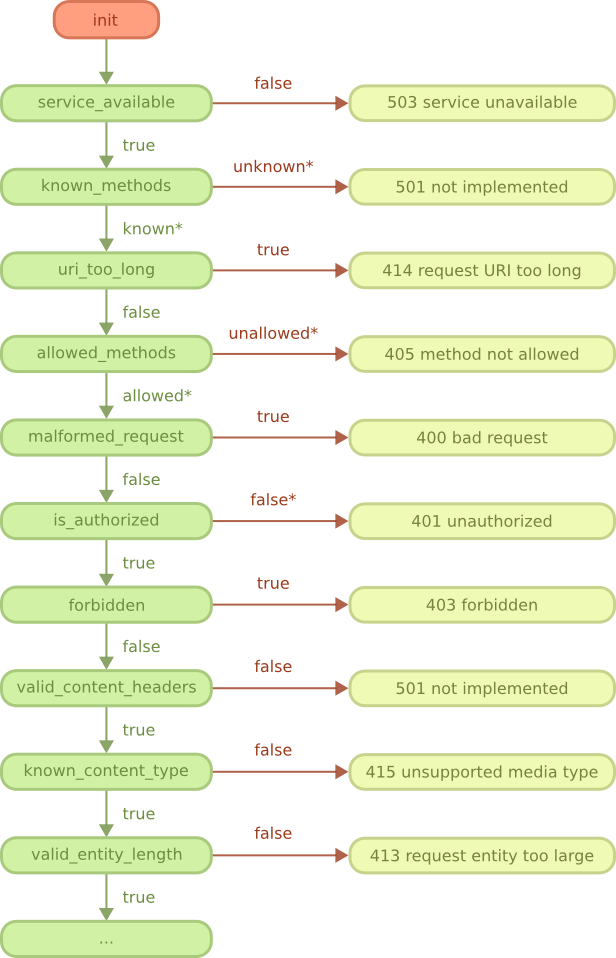
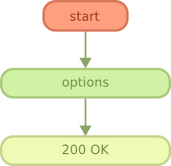
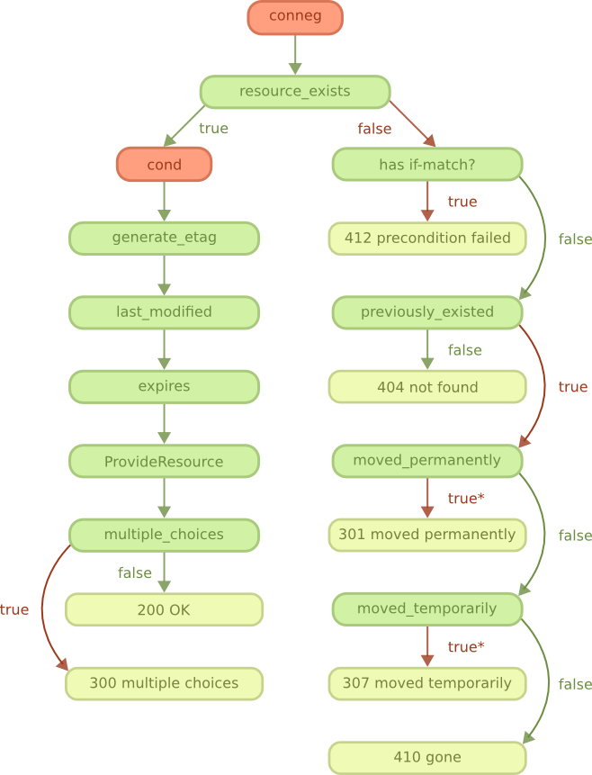
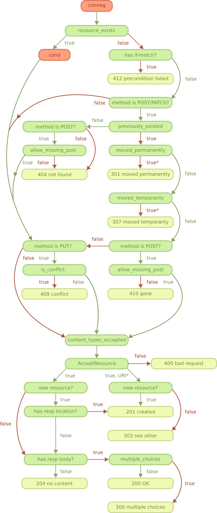

REST flowcharts
===============

This chapter will explain the REST handler state machine through a 
number of different diagrams.

There are four main paths that requests may follow. One for the method 
OPTIONS; one for the methods GET and HEAD; one for the methods PUT, 
POST and PATCH; and one for the method DELETE.

All paths start with the "Start" diagram, and all paths excluding the 
OPTIONS path go through the "Content negotiation" diagram and 
optionally the "Conditional requests" diagram if the resource exists.

The red squares refer to another diagram. The light green squares 
indicate a response. Other squares may be either a callback or a 
question answered by Cowboy itself. Green arrows tend to indicate the 
default behavior if the callback is undefined.

Start
-----

All requests start from here.

A series of callbacks are called in succession to perform a general 
checkup of the service, the request line and request headers.

The request body, if any, is not expected to have been received for any 
of these steps. It is only processed at the end of the "PUT, POST and 
PATCH methods" diagram, when all conditions have been met.

The `known_methods` and `allowed_methods` callbacks return a list of 
methods. Cowboy then checks if the request method is in the list, and 
stops otherwise.

The `is_authorized` callback may be used to check that access to the 
resource is authorized. Authentication may also be performed as needed. 
When authorization is denied, the return value from the callback must 
include a challenge applicable to the requested resource, which will be 
sent back to the client in the www-authenticate header.

This diagram is immediately followed by either the "OPTIONS method" 
diagram when the request method is OPTIONS, or the "Content 
negotiation" diagram otherwise.

OPTIONS method
--------------

This diagram only applies to OPTIONS requests.

The `options` callback may be used to add information about the 
resource, such as media types or languages provided; allowed methods; 
any extra information. A response body may also be set, although 
clients should not be expected to read it.

If the `options` callback is not defined, Cowboy will send a response 
containing the list of allowed methods by default.

Content negotiation
-------------------

This diagram applies to all request methods other than OPTIONS. It is 
executed right after the "Start" diagram is completed.

The purpose of these steps is to determine an appropriate 
representation to be sent back to the client.

The request may contain any of the accept header; the accept-language 
header; or the accept-charset header. When present, Cowboy will parse 
the headers and then call the corresponding callback to obtain the list 
of provided content-type, language or charset for this resource. It 
then automatically select the best match based on the request.

If a callback is not defined, Cowboy will select the content-type, 
language or charset that the client prefers.

The `content_types_provided` also returns the name of a callback for 
every content-type it accepts. This callback will only be called at the 
end of the "GET and HEAD methods" diagram, when all conditions have 
been met.

The selected content-type, language and charset are saved as meta 
values in the Req object. You *should* use the appropriate 
representation if you set a response body manually (alongside an error 
code, for example).

This diagram is immediately followed by the "GET and HEAD methods" 
diagram, the "PUT, POST and PATCH methods" diagram, or the "DELETE 
method" diagram, depending on the method.

GET and HEAD methods
--------------------

This diagram only applies to GET and HEAD requests.

For a description of the `cond` step, please see the "Conditional 
requests" diagram.

When the resource exists, and the conditional steps succeed, the 
resource can be retrieved.

Cowboy prepares the response by first retrieving metadata about the 
representation, then by calling the `ProvideResource` callback. This is 
the callback you defined for each content-types you returned from 
`content_types_provided`. This callback returns the body that will be 
sent back to the client, or a fun if the body must be streamed.

When the resource does not exist, Cowboy will figure out whether the 
resource existed previously, and if so whether it was moved elsewhere 
in order to redirect the client to the new URI.

The `moved_permanently` and `moved_temporarily` callbacks must return 
the new location of the resource if it was in fact moved.

PUT, POST and PATCH methods
---------------------------

This diagram only applies to PUT, POST and PATCH requests.

For a description of the `cond` step, please see the "Conditional 
requests" diagram.

When the resource exists, first the conditional steps are executed. 
When that succeeds, and the method is PUT, Cowboy will call the 
`is_conflict` callback. This function can be used to prevent potential 
race conditions, by locking the resource for example.

Then all three methods reach the `content_types_accepted` step that we 
will describe in a few paragraphs.

When the resource does not exist, and the method is PUT, Cowboy will 
check for conflicts and then move on to the `content_types_accepted` 
step. For other methods, Cowboy will figure out whether the resource 
existed previously, and if so whether it was moved elsewhere. If the 
resource is truly non-existent, the method is POST and the call for 
`allow_missing_post` returns `true`, then Cowboy will move on to the 
`content_types_accepted` step. Otherwise the request processing ends 
there.

The `moved_permanently` and `moved_temporarily` callbacks must return 
the new location of the resource if it was in fact moved.

The `content_types_accepted` returns a list of content-types it 
accepts, but also the name of a callback for each of them. Cowboy will 
select the appropriate callback for processing the request body and 
call it.

This callback may return one of three different return values.

If an error occurred while processing the request body, it must return 
`false` and Cowboy will send an appropriate error response.

If the method is POST, then you may return `true` with an URI of where 
the resource has been created. This is especially useful for writing 
handlers for collections.

Otherwise, return `true` to indicate success. Cowboy will select the 
appropriate response to be sent depending on whether a resource has 
been created, rather than modified, and on the availability of a 
location header or a body in the response.

DELETE method
-------------

This diagram only applies to DELETE requests.

For a description of the `cond` step, please see the "Conditional 
requests" diagram.

When the resource exists, and the conditional steps succeed, the 
resource can be deleted.

Deleting the resource is a two steps process. First the callback 
`delete_resource` is executed. Use this callback to delete the resource.

Because the resource may be cached, you must also delete all cached 
representations of this resource in the system. This operation may take 
a while though, so you may return before it finished.

Cowboy will then call the `delete_completed` callback. If you know that 
the resource has been completely deleted from your system, including 
from caches, then you can return `true`. If any doubts persist, return 
`false`. Cowboy will assume `true` by default.

To finish, Cowboy checks if you set a response body, and depending on 
that, sends the appropriate response.

When the resource does not exist, Cowboy will figure out whether the 
resource existed previously, and if so whether it was moved elsewhere 
in order to redirect the client to the new URI.

The `moved_permanently` and `moved_temporarily` callbacks must return 
the new location of the resource if it was in fact moved.

Conditional requests
--------------------

This diagram applies to all request methods other than OPTIONS. It is 
executed right after the `resource_exists` callback, when the resource 
exists.

A request becomes conditional when it includes either of the if-match 
header; the if-unmodified-since header; the if-none-match header; or 
the if-modified-since header.

If the condition fails, the request ends immediately without any 
retrieval or modification of the resource.

The `generate_etag` and `last_modified` are called as needed. Cowboy 
will only call them once and then cache the results for subsequent use.
